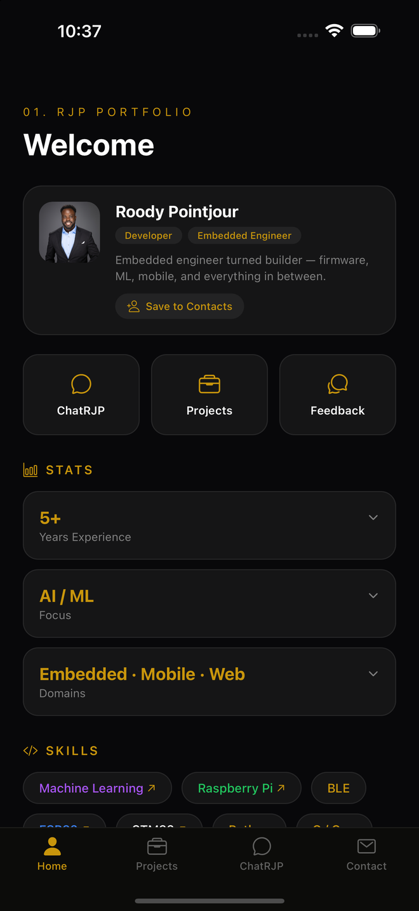
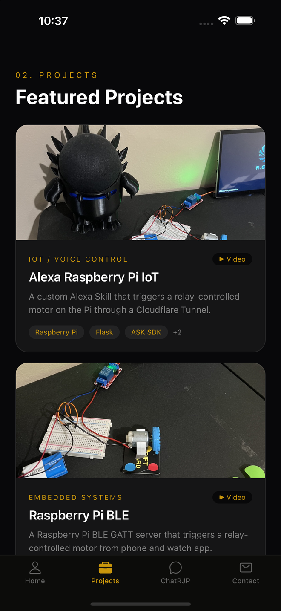
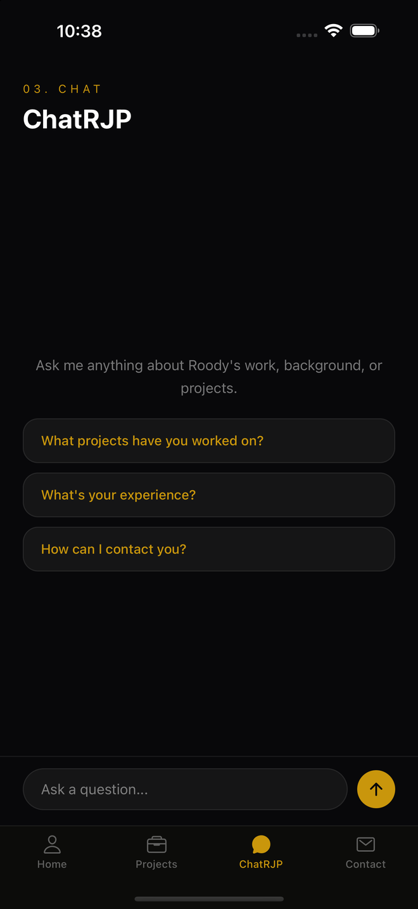
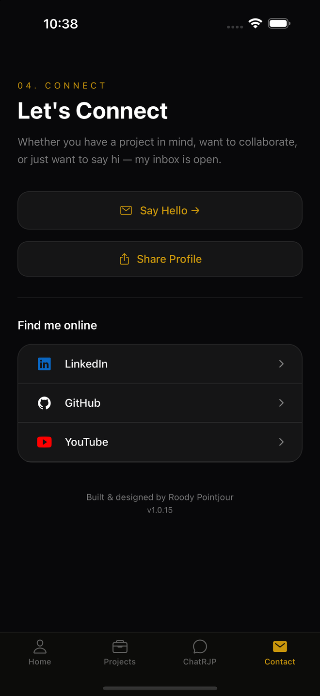
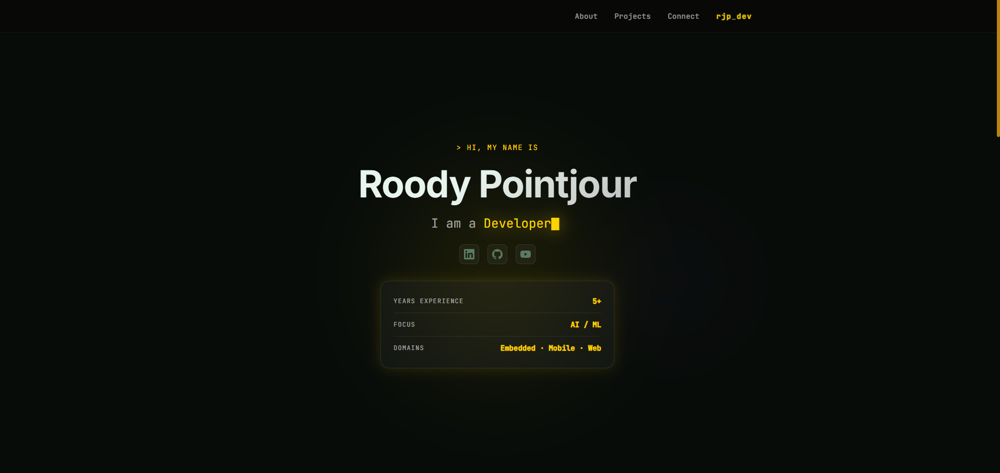
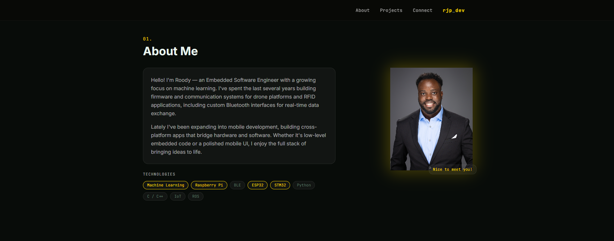
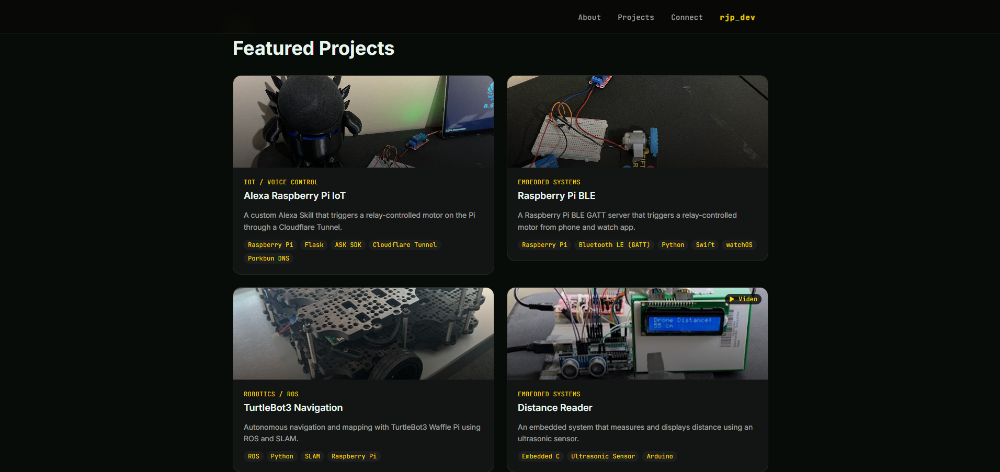

# RJP Portfolio

<p align="center">
  
</p>

A full-stack personal portfolio — web app + native iOS/Android mobile app + a Cloudflare Worker backend — built as a pnpm monorepo.

**Live site:** https://rpointjour.github.io/digital_business_card
**iOS app:** live on the [App Store](https://apps.apple.com/us/app/rjp-portfolio/id6782103881) (v1.0.15)

---

## What's Inside

| Package | Stack | Description |
|---|---|---|
| `packages/web` | React 18, Vite, Tailwind CSS 4, Framer Motion | Portfolio web app, deployed to GitHub Pages |
| `packages/mobile` | Expo SDK 57, React Native 0.86, expo-router 57 | iOS + Android native app |
| `packages/chat-proxy` | Cloudflare Workers, D1 | Backend for the mobile app: AI chat, GitHub feed, Feedback wall |
| `packages/shared` | TypeScript | Shared profile data, projects, skills |

---

## Mobile App

Current version: **v1.0.15** — approved and live on the iOS App Store. The Android version is not yet public on Google Play.

The app is more than a portfolio to scroll through — it talks to a live backend, so the content changes as you use it.

### Screens

**Home** — Bio card with one-tap **Save to Contacts** (native contacts, with photo on iOS), quick-access tiles, tap-to-expand stats, animated skill chips, and a **live GitHub feed** of recent activity and repositories.

**Projects** — Project cards with thumbnails and demo videos (YouTube deep-links into the YouTube app), plus a **Feedback wall** at the bottom: visitors leave comments that are AI-moderated before posting, and can delete their own comment via a private per-device token — no accounts needed.

**ChatRJP** — An AI assistant (Claude Haiku) that answers questions about the experience, projects, and background, grounded in the real profile and project data.

**Connect** — Say Hello (copies email), native **Share** sheet, and social links (LinkedIn, GitHub, YouTube).

### Tech
- Expo SDK 57 · expo-router 57 · React Native 0.86
- `expo-contacts`, `expo-secure-store`, `expo-haptics`, `expo-clipboard`, `expo-web-browser`
- Backend calls go through the `chat-proxy` Cloudflare Worker, so no API keys ship in the app
- `react-native-safe-area-context` for dynamic tab bar height (Android nav bar)
- EAS Build + EAS Submit for store distribution

### Screenshots

| Home | Projects | ChatRJP | Connect |
|------|----------|---------|---------|
|  |  |  |  |

### Download
- **iOS** — [App Store](https://apps.apple.com/us/app/rjp-portfolio/id6782103881)
- **Android** — [Google Play](https://play.google.com) *(add link once public)*

---

## Backend (`chat-proxy`)

A Cloudflare Worker that the mobile app calls instead of hitting third-party APIs directly:

| Route | Purpose |
|---|---|
| `POST /` | ChatRJP — proxies to the Anthropic API (Claude Haiku), rate-limited per IP |
| `GET /guestbook`, `POST /guestbook` | Feedback wall — stored in Cloudflare D1, each post screened by an AI moderation check first, rate-limited |
| `DELETE /guestbook/:id` | Delete a comment — by the author's private delete token, or by the admin key |
| `GET /github` | Recent GitHub activity + repos, cached at the edge for 10 minutes |

Secrets (`ANTHROPIC_API_KEY`, `GITHUB_TOKEN`, `ADMIN_SECRET`) live in Worker secrets, never in the repo. Deploy with `npx wrangler deploy` from `packages/chat-proxy` (requires Node 22+).

---

## Web App

Built with React + Vite + Tailwind CSS 4. Framer Motion for animations. Deployed via GitHub Pages.

### Screenshots

| Home | About Me | Projects | Connect |
|------|----------|----------|---------|
|  |  |  |  |

---

## Project Structure

```
digital_business_card/
├── packages/
│   ├── web/          # React + Vite web portfolio
│   ├── mobile/       # Expo React Native app
│   ├── chat-proxy/   # Cloudflare Worker (AI chat, GitHub feed, Feedback wall)
│   └── shared/       # Shared TS data (profile, projects, skills)
├── package.json      # pnpm workspace root
└── pnpm-workspace.yaml
```

---

## Local Development

### Prerequisites
- Node.js 18+ (Node 22+ for the `chat-proxy` Worker / wrangler)
- pnpm
- Expo Go app on your device (for mobile dev)

### Web

```bash
pnpm install
pnpm start          # starts Vite dev server
```

### Mobile

```bash
cd packages/mobile
pnpm start          # starts Expo dev server
# then scan QR code with Expo Go
```

To run on a specific platform:

```bash
pnpm ios      # iOS
pnpm android  # Android
```

### Deploy Web

```bash
pnpm run deploy   # builds and pushes to GitHub Pages (bare `pnpm deploy` hits pnpm's built-in command)
```

---

## Mobile Build & Release (EAS)

```bash
cd packages/mobile

# Production build (both platforms)
eas build --platform all --profile production

# Submit to stores
eas submit --platform all --profile production
```

App config: [`packages/mobile/app.json`](packages/mobile/app.json)
EAS config: [`packages/mobile/eas.json`](packages/mobile/eas.json)

- **iOS bundle ID:** `com.rjpdev.portfolio`
- **Android package:** `com.rjpdev.portfolio`
- **EAS project:** `22eb7709-1e2b-4312-a32c-7e12f53e7d00`

---

## Shared Data

All profile content lives in `packages/shared/src/` and is consumed by both web and mobile:

- `profile.ts` — name, bio, summary, stats, links
- `projects.ts` — project list with thumbnails and video URLs
- `skills.ts` — tech stack with optional color coding

---

## License

Personal portfolio — all rights reserved.
